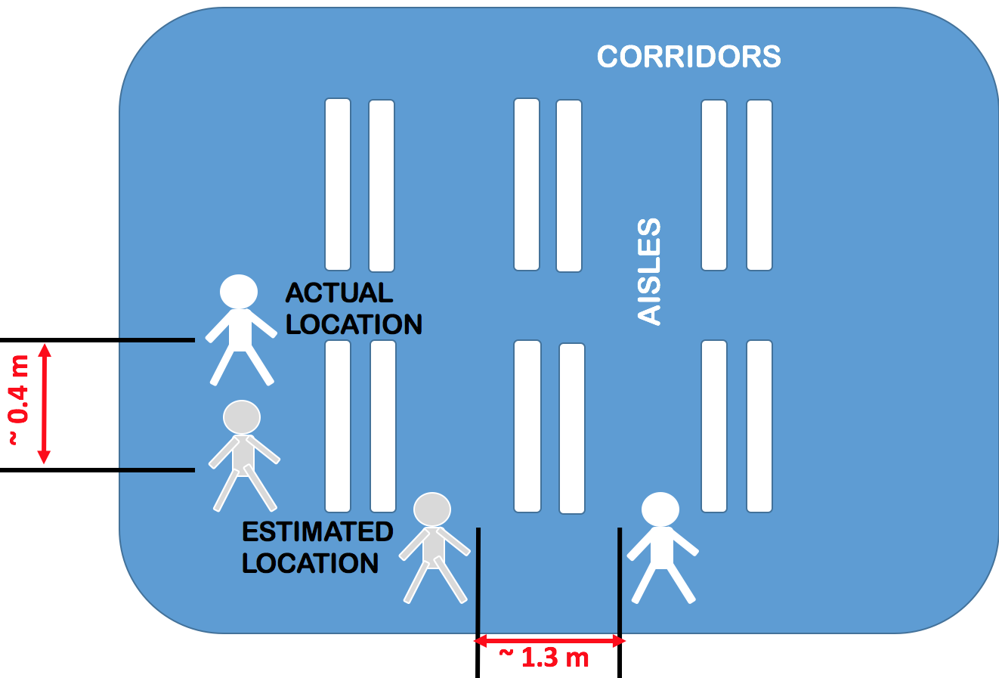

 [Home](#indoor-localization)  [About](#key-features)  [Releases](#releases)  [Papers](#papers)  [Contact-Us](#contact-us)

|Motivation | Result |
| ------- |-------  |
|  |  |

### Indoor Localization

Places like retail stores, museums, libraries are gradually moving towards a more automated experinece for customers. [Amazon Go](https://www.youtube.com/watch?v=NrmMk1Myrxc) serves as an example where customers can do automated checkout of their items. Towards this end, tracking the activity of the customers in such spaces becomes an important problem that needs to be solved with high accuracy.

Finding by counting is a system which can currently localize moving customers with decimeter level accuracy. 

### Key Features

Finding by counting supports the localization of moving customers with the following features:

*  #### Decimeter Level Accuracy 
      Finding by Counting can find physical co-ordinates of moving customers at regular intervals with an average accuracy of       0.4 meters.
*  #### Bluetooth Low Energy(BLE) iBeacons
      Finding by Counting uses BLE beacons as anchor nodes for localization.
*  #### Uses Packet Count / No to RSSI
      Most techniques use RSS or strength values of signals from fixed devices like WiFi APs and then map that to 
      distance either through fingerprinting or by deriving a mathamatical model of signal strength decay with distance.
      Finding by Couting ignores RSS value altogether due to its high variance and unreliability in indoor settings.

### Our Solution

In our work, we estimate distance by counting the number of packets received from stationary beacons. 

* We train a Generalized Linear Model(GLM) on fraction of packets received from beacons. GLM contains distance, beaconing   power and advertising frequency of beacons as parameters. 
### Releases
                  
Our first version of Finding by Counting is out. Check it now!

### Papers

`IN PRESS` [Finding by Counting: A Probabilistic Packet Count Model for Indoor Localization in BLE Environments](http://arxiv.org/abs/1708.08144)
  
Subham De, Shreyans Chowdhary, Aniket Shirke, Yat Long Lo, Robin Kravets and Hari Sundaram, **WiNTECH, Mobicom'17**, Snowbird, UT, USA. October 2017
  
### Contact Us

Finding by Counting is being developed by a team of undergraduate and graduate students headed by [Prof. Hari Sundaram](http://sundaram.cs.illinois.edu/) along with  Prof. Robin Kravets. The list of contributors includes: Subham De, Shreyans Chowdhary, Aniket Shirke, Yat Long Lo. 

Please reach out to the lead PhD student, Subham De (de5@illinois.edu) if you'd like to either contribute, or be a tester of Finding by Counting!
